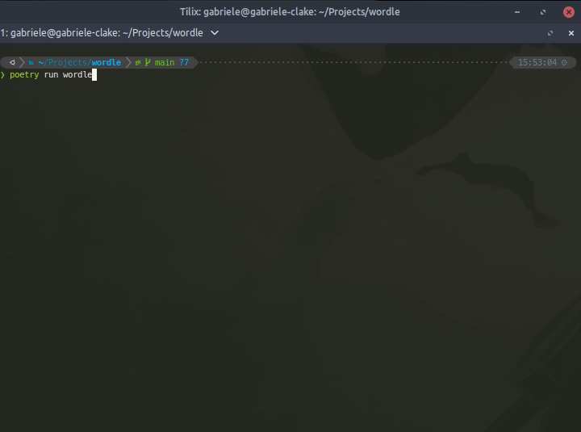

# Wordle

A simple, pure Python [Wordle](https://www.powerlanguage.co.uk/wordle/)
implementation.

## How to play

Install from GitHub using `pip`/`pipx` and run with `wordle`

~~~console
pipx install git+https://github.com/p403n1x87/wordle.git
wordle
~~~

## Wordle solver

Use the solver with

~~~console
wordle-solve
~~~

You will be asked for your initial guess and for the outcome. Use 0 for a gray
tile, 1 for a yellow one and 2 for a green one. You will be suggested the next
word to try. Use it and then report the outcome. Hopefully you will get the word
you are looking for in less than 6 moves 🙂. Tests show that the solution is
correctly guessed in 100% of the cases.

### How the solver works

The high-level strategy is to shrink the set of possible words as much as
possible after each attempt. To this end, the solver counts the number of words
in which each letter appears. It then computes a score for each word based on
the (unique) letters that are not known to be in the final solution and summing
their word counts. At each attempt, this should guarantee that we a good number
of words.
